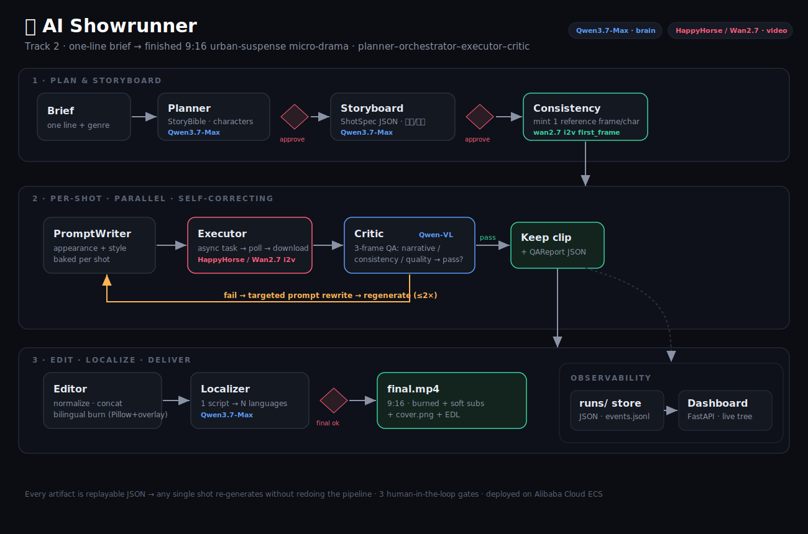

# AI Showrunner — Vertical Short-Drama Agent


Submission for **Track 2 (AI Showrunner)** of the Global AI Hackathon Series with Qwen Cloud.
An autonomous agent that takes a one-line brief and produces a finished **9:16 urban-suspense
micro-drama**: script → story bible → storyboard → per-shot video → self-critiqued regeneration →
edit → multi-language subtitles.

**See it:** [gallery](docs/devpost/gallery/) · [demo reel](docs/devpost/demo_reel_draft.mp4) ·
a complete replayable production in [samples/night-shift-double](samples/night-shift-double/)
(story bible → shots → EDL → `final.mp4` with zh/en/es subtitle tracks).

## Why this is more than "prompt → video"

- **Structured, cacheable artifacts** (`StoryBible → ShotSpec → QAReport → EDL`, all Pydantic) so any
  single shot re-runs without redoing the pipeline.
- **Closed-loop critic**: Qwen-VL scores each clip vs. its `ShotSpec` on narrative alignment /
  character consistency / technical quality, and drives *targeted* regeneration (≤2 retries).
- **Character-consistency engine**: one canonical reference frame reused via image-to-video across shots.
- **Human-in-the-loop gates** at outline, storyboard, and final cut.
- **Multi-language localization**: one master script → subtitle tracks in N languages (global short-drama value).

## Stack

Python 3.11 · FastAPI · asyncio · Pydantic · OpenAI SDK (Qwen text/VL) · httpx (async video) · ffmpeg.
Deployed on Alibaba Cloud ECS (Singapore).

## Quick start

```bash
python -m venv .venv && source .venv/bin/activate
pip install -r requirements.txt        # + brew install ffmpeg
cp .env.example .env                    # paste your DASHSCOPE_API_KEY
python -m scripts.smoke_test           # verifies text + VL + video end-to-end
```

## Architecture



Planner (Qwen3.7-Max) → [HITL] → Storyboard → [HITL] → per-shot { PromptWriter → HappyHorse/Wan I2V →
Qwen-VL 3-frame Critic → retry } → ffmpeg Editor → [HITL] → final cut + covers + subtitle tracks.
Full write-up: [docs/architecture.md](docs/architecture.md).

## Sample outputs (validated on live QwenCloud)

| Run | What it shows |
|-----|---------------|
| `完美不在场` | reversal twist, bilingual burned subtitles |
| `The Sandbox Loop` (`--consistency i2v`) | same character across shots (cc = 9–10) via i2v reference frame |
| `夜班替身` | 26s · 4 shots · **zh/en/es** subtitle tracks · a shot scored na 9 / cc 10 / tq 9 |

Each `runs/<id>/` holds the replayable JSON (`story_bible`, `shots`, per-shot `*_qa*`, `edl`,
`events.jsonl`) plus `final.mp4` + `cover.png`. One full production (《夜班替身》) ships in this
repo under [samples/night-shift-double](samples/night-shift-double/).

## Run it

```bash
# CLI (autonomous, or --interactive for terminal HITL gates)
python -m scripts.run "A detective realizes the victim is her own alibi" --langs zh,en,es --interactive

# Web dashboard (live shot tree, QA scores, browser HITL gates)
uvicorn showrunner.server:app --host 0.0.0.0 --port 8000   # -> http://localhost:8000
```

## Status

- [x] Config, schemas, Qwen + video clients, smoke test — **validated on live QwenCloud API**
- [x] Planner / Storyboard agents (Qwen3.7-Max, structured JSON, master-language dialogue)
- [x] Executor + **multi-frame** Critic retry loop (Qwen3.6-Plus judges 3 frames = real motion QA)
- [x] **Character-consistency engine**: wan2.7 i2v `first_frame` reference (`--consistency i2v`), verified same face across shots
- [x] Editor: normalize/concat + **bilingual burned subtitles** (Pillow+overlay) + multi-language soft tracks + titled cover
- [x] FastAPI + live dashboard, HITL gate controller, content-filter resilience
- [x] **Resume + targeted regen**: `--resume RUN_ID` / per-shot ↻ Regen button — reuses QA-passed clips, subtitle cache makes re-assembly free (verified $0)
- [x] **Shot lifecycle + version stacks**: explicit states (draft→…→approved→locked) + takes with a floating current pointer — switching takes re-assembles the final at $0 (verified)
- [x] **Frame Gate** (`--frame-gate`): approve cheap first-frame stills before any video spend; the approved frame becomes the shot's i2v first frame
- [x] **Pre-flight estimate + budget admission**: exact $ next to the Start button; over-budget refuses new spend, never kills in-flight work
- [x] **Extend / Jump-To**: continue the action from the last frame, or cut to a new scene carrying the cast
- [x] **Tiered QA** (free ffprobe precheck before VL judge) · camera presets + director's notes on regen · editable approval gates · `@character` cast reuse from the library
- [x] **Production-ready**: Bearer-token auth (`SHOWRUNNER_TOKEN`) · single job queue serializing generation · `/healthz` + request logs · **AIGC compliance label** (burned 「AI生成」badge + container metadata) · Dockerfile + docker-compose
- [x] Docs: [architecture](docs/architecture.md) · [ECS quickstart](docs/ECS_QUICKSTART.md) · [deploy](docs/DEPLOY.md) · [demo script](docs/DEMO_SCRIPT.md) · [Devpost pack](docs/DEVPOST.md)
- [ ] Run full-length flagship drama (hero demo asset)
- [ ] Deploy to Alibaba Cloud ECS · record 3-min video
- [ ] *Stretch:* TTS voiceover · driving_audio / last_frame i2v controls
