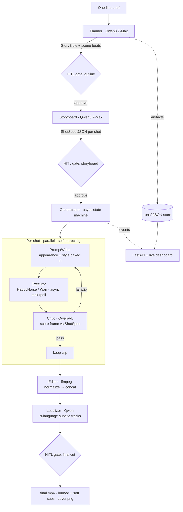

# Architecture

AI Showrunner turns a one-line brief into a finished vertical short drama through a
planner → orchestrator → executor → critic loop, with every intermediate artifact stored as
replayable JSON so any single shot can be regenerated in isolation.

## Why each piece exists (mapped to judging criteria)

| Judging axis | Where we earn it |
|---|---|
| **Technical Depth (30%)** | Async task/poll video pipeline, parallel shot generation, bounded critic/retry loop, Pydantic-validated artifacts, event-sourced state, HITL gate controller with timeout fallback. |
| **Innovation & AI Creativity (30%)** | Closed-loop Qwen-VL critic that drives *targeted* regeneration (not one-shot); character-consistency via reused appearance descriptors / reference-to-video; one-script→N-language localization. |
| **Problem Value & Impact (25%)** | Vertical short drama is a booming global format; auto-localization unlocks cross-market distribution — the real bottleneck for studios. |
| **Presentation & Docs (15%)** | Live dashboard makes the orchestration *visible*; this diagram + deploy proof + replayable runs. |

## Data flow / artifacts (all under `runs/<id>/`)

`story_bible.json` · `scenes.json` · `shots.json` · `shots/<id>_qa<n>.json` ·
`subtitles.json` · `edl.json` · `events.jsonl` (append-only log) ·
media: `shots/*.mp4`, `master.mp4`, `final.mp4`, `cover.png`, `subs_<lang>.srt`.

## Models

| Role | Model | Access |
|---|---|---|
| Planner / storyboard / prompt / localize | `qwen3.7-max` (+`-plus`) | OpenAI-compatible endpoint |
| Critic (vision) | `qwen3.6-plus` (VL) | OpenAI-compatible endpoint |
| Video executor | `happyhorse-1.1-*` / `wan2.7-*` | DashScope async video-synthesis |

All model IDs are env-driven (`.env`) and verified by `scripts/smoke_test.py`.
